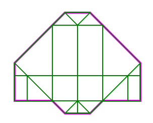

paiv - icfpc 2016
=================

Origami folding
http://icfpc2016.blogspot.com/

Notes
-----

Solver is in very early stage, I spent time mostly on preprocessing.

Problem generator makes a simple shape, with variable width.

Implementation
--------------

* C/C++ – solver
* Python – processing, batching
